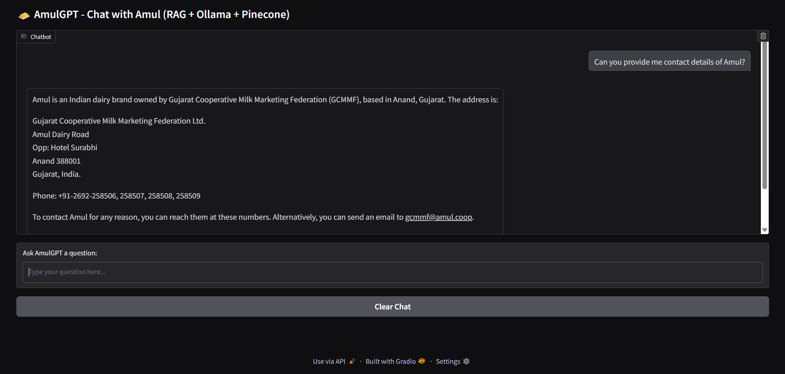
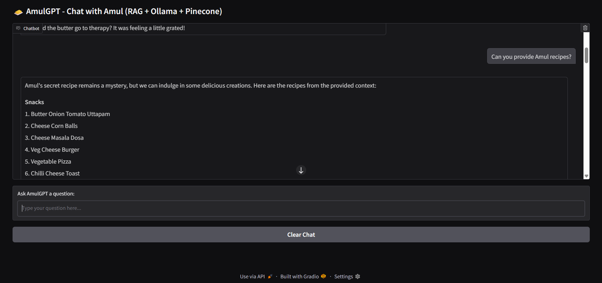
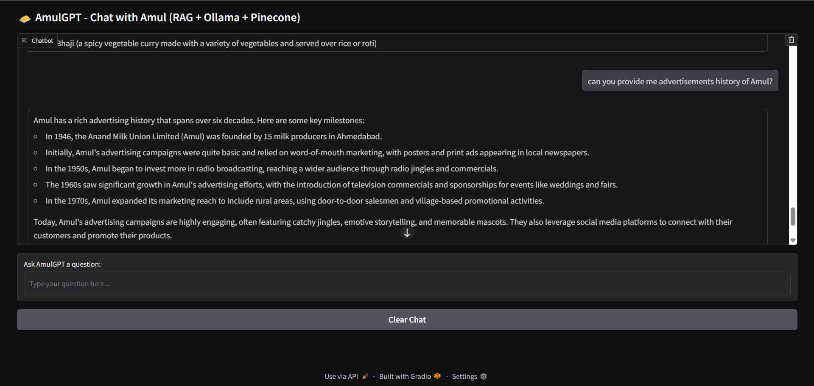

# Project Overview

## Project Introduction
AmulGPT is an interactive AI chatbot that combines RAG (Retrieval-Augmented Generation), Ollama, and Pinecone to provide intelligent, context-aware answers. Inspired by the name Amul, this project allows users to query information and receive detailed responses based on pre-loaded documents or datasets.

The chatbot uses:
- Gradio for a clean and interactive web interface.
- Ollama as the local language model engine.
- Pinecone as the vector database for fast and accurate semantic search.
- RAG pipeline to integrate document retrieval with generative AI for precise answers.

## Implementation
<p align="center">
  
  
  
</p>

## Installation

Follow these steps to set up and run **AmulGPT**.

### 1. Clone the repository
```bash
git clone https://github.com/SrajalDixit/AmulGPT
cd AmulGPT
```

### 2. Conda Environment Setup
```bash
conda create -n amulgpt python=3.10
```

#### Create environment
```bash
conda create -n amulgpt python=3.10
```

#### Activate environment
```bash
conda activate amulgpt
```

#### Install dependencies
```bash
conda env update --file environment.yml
```

### 3. Running Python Files
```bash
python app/gradio_app.py
```

### Docker Setup

#### Build Docker image
```bash
docker build -t srajaldixit/amulgpt:latest .
```

#### Run Docker container
```bash
docker run -d --name amulgpt --env-file .env --network host srajaldixit/amulgpt:latest
```

#### Remove container
```bash
docker rm -f amulgpt
```

### 5. Ollama Setup

#### Install Ollama

```bash
curl -fsSL https://ollama.com/install.sh | sh
```

#### Pull a model

```bash
ollama pull llama3.2:1b
```
#### Run the model
```bash
ollama run llama3.2:1b
```
## Usage

### Running Locally

After setting up the conda environment:

```bash
conda activate amulgpt
python app/gradio_app.py
```


### Running via Docker

#### Build the Docker image
```bash
docker build -t srajaldixit/amulgpt:latest .
```
#### Run the Docker container
```bash
docker run -p 8000:8000 --env-file .env srajaldixit/amulgpt:latest
```
⚠️ Note : The model may hallucinate sometimes due to weak prompts or model limitations.


